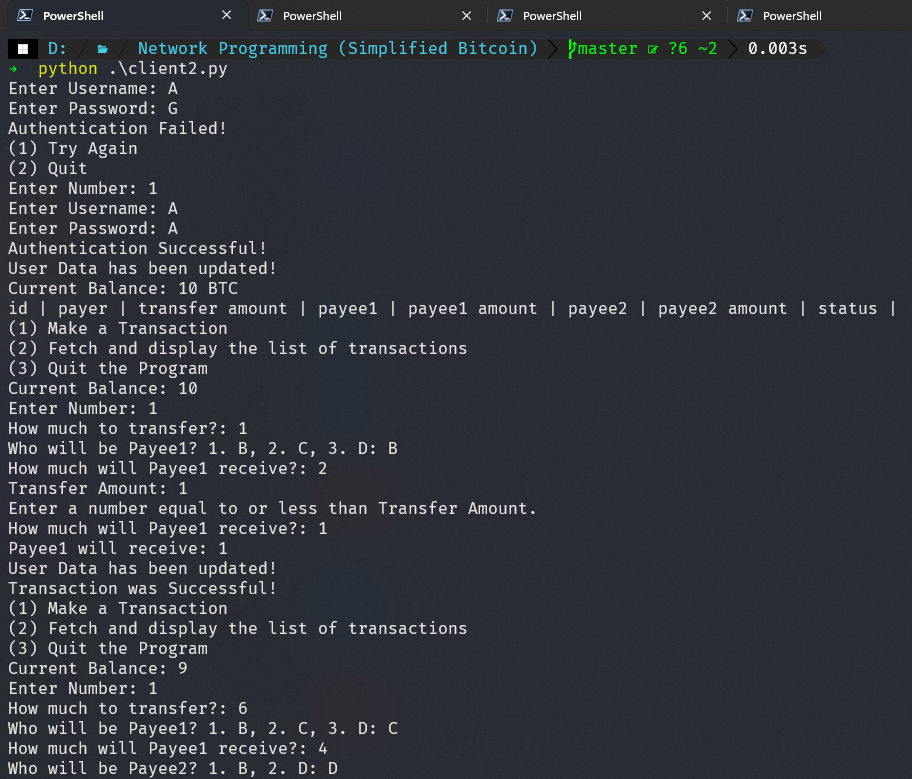
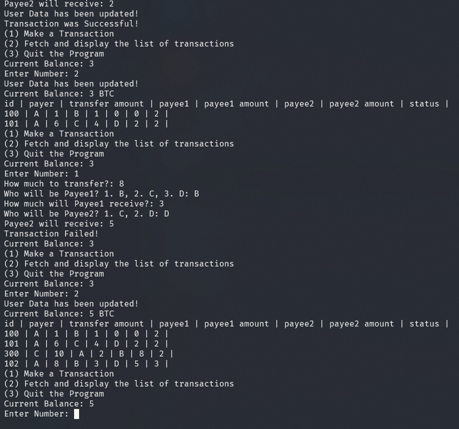
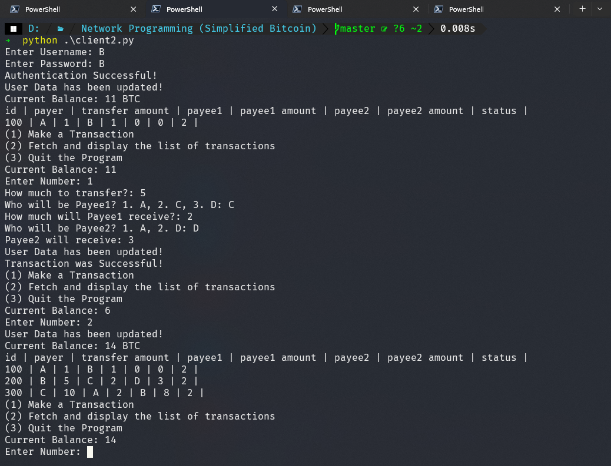
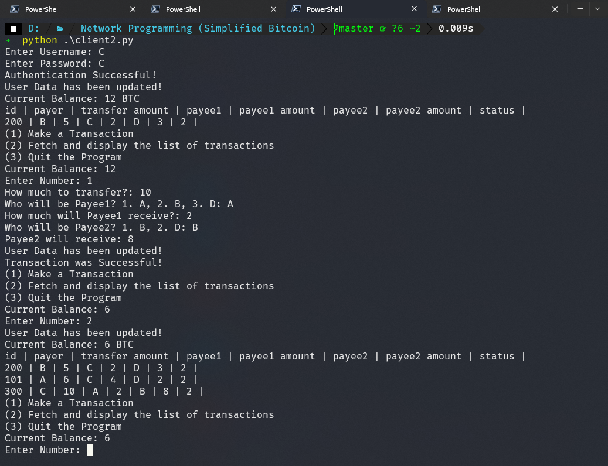
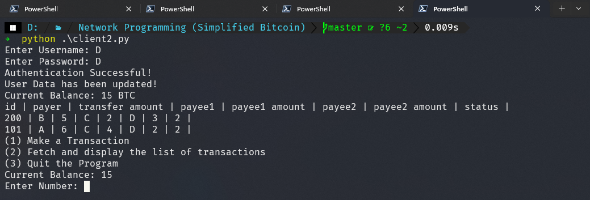
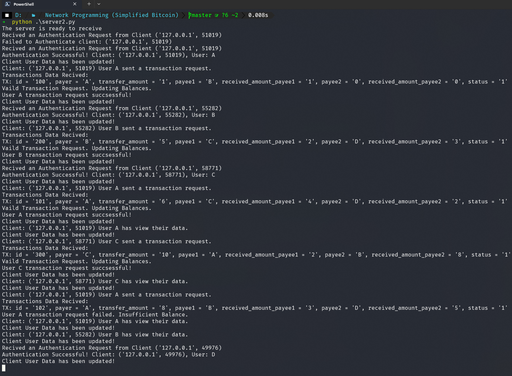

# Network programming (Simplified Bitcoin)
## Adolfo Sanpedro Gante & Kento Uematsu

### Test Result Outputs

### Client A Output (1/2)

### Client A Output (2/2)

### Client B Output

### Client C Output

### Client D Output

### Server Output
